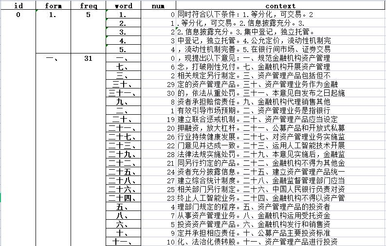

## 指标计算<!-- {docsify-ignore} -->

##### 初始指标体系（2021年5月版）：


计算所有指标的程序已经集成在 PolicyAnalysis > KnowPolicy Alpha 1.0.py 中，读者可以[直接进行调用](QuickStart?id=_1指标计算工具)，如果需要对指标进行调整和修改，可以参考如下内容：

### 1. Supervisors

见 PolicyAnalysis > Supervisors.py
#### 颁布主体行政级别

**级别划分：**

- 国务院发布：2 分
- 人民银行：1.5 分
- 银保监会、证监会及各行业协会：1 分

(分值可以在 tools > words_list > 赋分指标清单.xlsx > 颁布主体行政级别中修改)

**计算方法：**对某一文本的来源和标题分别进行检索，记录匹配到的所有行政主体，并取其中最高分，然后来源和标题各自得到的结果再次进行比较，取其中最大值，得到该文本最终的颁布主体行政级别得分 (见 PolicyAnalysis > Supervisors.py)

```python
# 导入数据、关键词清单并检索结果（略）
# -------------------------------------
result_title = result.DTM  # 获取检索标题得到的词频矩阵
point_title = cj.dtm_point_giver(result_title, self.sr_map, self.pt_map)  # 使用 cptj 的赋分函数实现赋分

result_source = result.DTM  # 获取检索来源得到的词频矩阵
point_source = cj.dtm_point_giver(result_source, self.sr_map, self.pt_map)  # 使用 cptj 的赋分函数实现赋分

# 合并标题得分结果和来源得分结果
two_point = pd.concat([point_title, point_source], axis=1)

# 最终得分是标题和来源的颁布主体得分取最大值
final_point = pd.DataFrame(two_point.agg(np.max, axis=1), columns=['颁布主体得分'])
```
dtm_point_giver 的原理及使用方法在[支持包 cptj 当中](cptj?id=dtm_point_giver)


#### 是否联合发布

- 联合发布：2 分
- 非联合发布：1 分

(分值可以在 Supervisors.py 中进行修改)

```python
# 为了将各项指标都控制在同一量纲内 (1-2)，这里再补充一次映射
final_class = final_class.applymap(lambda x: 2 if x > 1 else 1)
```

**计算方法：**对某一文本的来源和标题分别进行检索，记录匹配到的所有行政主体并分类，保留种类数，然后来源和标题各自得到的结果再次进行比较，取其中最大值，若该值大于 1，说明为联合发布，赋值为 2，若小于等于 1，说明为非联合发布，赋值为 1，最终得到该文本的联合发布情况得分 (见 PolicyAnalysis > Supervisors.py)

```python
# 导入数据、关键词清单、检索结果、获取 DTM（同上）
# -------------------------------------
class_title = cj.dtm_sort_filter(result_title, self.sr_map)['DTM_final']  # 使用 cptj 的分拣函数实现类别统计
class_source = cj.dtm_sort_filter(result_source, self.sr_map)['DTM_final']  # 使用 cptj 的分拣函数实现类别统计

# 合并标题计类结果和来源计类结果
two_class = pd.concat([class_title, class_source], axis=1)

# 比较标题和来源的颁布主体类别数，并取最大值
final_class = pd.DataFrame(two_class.agg(np.max, axis=1), columns=['是否联合发布'])

# 类别数大于 1 则赋 2 分，小于等于 1 则赋 1 分
final_class = final_class.applymap(lambda x: 2 if x > 1 else 1)
```
dtm_sort_filter 的原理和使用方法在[支持包 cptj 当中](cptj?id=dtm_sort_filter)

### 2. Negative Tone

见 PolicyAnalysis > NegtiveTone.py


#### 绝对负向语调

$$NegTone_i^A = Negative_i$$

```python
# 获取总词数
data_sum = data.agg(np.sum, axis=1)
# 获取负向情感词词数
negative_sum = negative_tone.agg(np.sum, axis=1)
# 计算负向情感词词频（绝对负向情感语调）
absolute_negative_tone = negative_sum/data_sum
```

#### ~~相对负向语调（已废止）~~

 $$ NegTone_i^R = {(Negative_i - Positive_i) \over (Negative_i + Positive_i)}$$

其中 $NegTone_i$ 是第 i 份文件中负向情感词词数占总词数的比例，$Positive_i$ 是第 i 份文件中正向情感词词数占总词数的比例

计算过程较为简单，只需从 DTM 中的词频统计结果加总再相除即可

```python
# 计算总词频
data_sum = data.agg(np.sum, axis=1)
# 计算正向情感词词数
positive_sum = positive_tone.agg(np.sum, axis=1)
# 计算负向情感词词数
negative_sum = negative_tone.agg(np.sum, axis=1)
# 计算相对负向情感语调
relative_negative_tone = (negative_sum - positive_sum)/(positive_sum + negative_sum)
```

### 3. Instituions

见 PolicyAnalysis > Institutions.py

**计算方法：**被监管机构的种类数无法确切地得知，只能近似地估计。我们认为，在政策文本前 50% 的内容中出现的相关金融机构即为被监管的机构，后续也可以灵活调整检索范围

```python
# 导入关键词清单，指标分类文件，导入数据等
# -------------------------------------

# 生成 Institution 分类字典, {'Institution': [keyword1, keyword2, keyword3, ....], ....}
keymap = {}
for i in range(df_indi.shape[1]):
    keymap[df_indi.columns[i]] = list(df_indi.iloc[:, i].dropna(''))
```

> [!NOTE]
> 由于关键词的同义复现，比如 “中国银保监会”、“银保监” 等，我们还需要第二个关键词清单来记录关键词的分类（详见 [cptj.dtm_sort_filter](cptj?id=dtm_sort_filter)），而分类时所需的 keymap 信息存放在一个 excel 表格当中：tools > words_list > 赋分指标清单.xlsx

```python
# 只取样本前50%的句子，句子个数不是整数的话就向下取整
for i in range(df.shape[0]):
    df.iloc[i, 2] = cj.top_n_sent(10, df.iloc[i, 2], percentile=0.5)
```

cj.top_n_sent 在[支持包 cptj 当中](cptj?id=top_n_sent)，可以很方便地用来选择词频统计的范围

```python
# 得到词向量矩阵
vect = cj.jieba_vectorizer(df.copy(), self.userdict, self.stopwords, orient=True)
ff = vect.DTM

# 使用 cptj 的分拣函数实现类别统计
ff = cj.dtm_sort_filter(ff, keymap)

dtm_final = ff['DTM_final'] # 获取机构的种类数
dtm_final = pd.DataFrame(dtm_final, columns=['被监管机构种类数'])
```

### 4. Business

见 PolicyAnalysis > Business.py

和被监管机构类似，想要得到被监管业务的确切数字也比较困难，经过反复试验，我们确定了正文 > 前十句 > 标题三者检索得到的种类数之平均作为最终结果

```python
# 导入数据、分词 + 检索、分拣函数计类（同上）
# ---------------------------------------

dtm1_final = dtm1_result['DTM_final']  # 按正文检索得到的被监管业务种类数
dtm2_final = dtm2_result['DTM_final']  # 按前十句话检索得到的被监管业务种类数
dtm3_final = dtm3_result['DTM_final']  # 按标题检索得到的被监管业务种类数

# 组合三个种类数
dtm_final = pd.concat([dtm1_final, dtm2_final, dtm3_final], axis=1)

# 三个种类数求平均值，得到被监管业务种类数
dtm_aver_class = dtm_final.agg(np.mean, axis=1)
```

> [!ATTENTION]
> 以上四个指标都是用了 jieba 分词处理+向量化，但是 jieba 不适用于标题层级和数字的统计（毕竟字母和阿拉伯数字一开始都被过滤掉了），因此下面两个指标使用了 cptj 中自定义的词频统计函数（基于 re 编写）来进行分析

### 5. titles

见 PolicyAnalysis > Titles.py

#### 标题级别数

**计算方法：**标题级别数是指一篇文本内有多少层次的标题，比如，文本的内容划分了 一、1、（1）三个层次，则可以说文本有三级标题，因此，只要文本排版方式统一，那么标题级别数也就等同于标题的种类数

```python
# 导入数据、编写标题对应的正则表达式（略）
# ------------------------------------

# 使用支持包 cptj 的词频统计函数得到标题统计结果
result = cj.infos_docs_freq(self.rules, data)

dfc = result['DFC']  # 获取统计结果的 DFC 形式

# 使用支持包 cptj 的 DFC 分拣函数统计标题种类
dfc_class = cj.dfc_sort_counter(dfc, '标题-正文分类统计.xlsx')
```

**DFC(Doc Frequency Context)：**这是支持包 cptj 中自定义的一种数据类型，本质上是使用了多重索引 (MultiIndex) 的 pandas.DataFrame

如图，id 表示文件编号，form 是标题的形式，对应着我们之间编写的正则表达式，freq 是对应词在文中出现的频次，word 就是匹配到的词语，num 是同一个词出现的顺序，context 是这个词的上下文（默认为前后各 10 个字符），使用 DFC 的初衷是解决 excel 里面查找词语，以及查看词语上下文极不方便的痛点（文本长，文件大，加载速度慢）



[dfc_sort_counter](cptj?id=dfc_sort_counter)：这是专门对 DFC 进行类别分拣的函数，因为不同于关键词的分拣，标题的分拣较为麻烦，没有一个现成的 keymap 用于对应词和类的关系，所以另起了一个函数，直接使用 DFC 进行类别统计

#### 标题总个数

```python
dtm = result['DTM']  # 获取统计结果的 DTM 形式

# 将 DTM 中的标题频数直接加总，得到标题的总个数
dtm_sum = dtm.agg(np.sum, axis=1)
```

计算结束之后就可以组合输出结果了

```python
# 组合标题级别数和标题总个数
dtm_final = pd.concat([dfc_class, dtm_sum], axis=1)
# 加上行名
dtm_final.columns = ['标题级别数', '标题总个数']
```


### 6. numeral

见 PolicyAnalysis > Numerals.py

**计算方法：**先把文本当中的标题全部去掉(因为标题中含有大量的数字)，同时补充去除一些图例、日期等信息，然后再去统计剩余的阿拉伯数字。值得注意的是，*我们只检索了汉字当中而非首尾的阿拉伯数字*，主要是由于存在部分标题残留（如 "3各单位应在···"）或超链接残留，而汉字当中的数字具有更高的信息价值（如 "应在不超过 30 天内完成登记" "划拨不低于 15 % 的账面现金"）


```python
# 导入数据、编写数字对应的正则表达式（略）
# ------------------------------------

# 使用支持包 cptj 中的分拣函数进行类别统计
numeral = cj.infos_docs_freq(self.digits, df)
self.DTM = numeral['DTM']
self.DFC = numeral['DFC']
```


