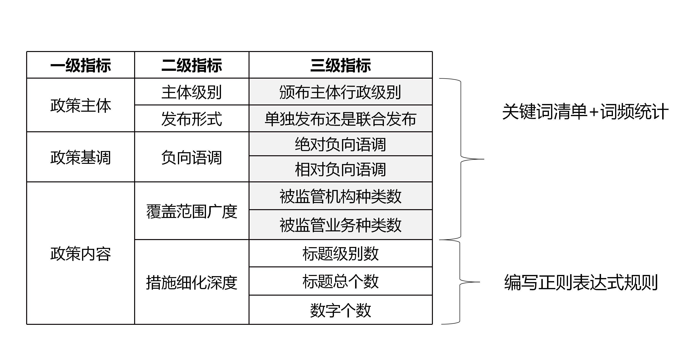

## 指标计算<!-- {docsify-ignore} -->

##### 初始指标体系（2021年5月版）：


计算所有指标的程序已经集成在 PolicyAnalysis > KnowPolicy Alpha 1.0.py 中，读者可以[直接进行调用](QuickStart?id=_1指标计算工具)，如果需要对指标进行调整和修改，可以参考如下内容：

### 1. Supervisors

见 PolicyAnalysis > Supervisors.py
#### 颁布主体行政级别

**级别划分：**

- 国务院发布：2 分
- 人民银行：1.5 分
- 银保监会、证监会及各行业协会：1 分

**计算方法：**对某一文本的来源和标题分别进行检索，记录匹配到的所有行政主体，并取其中最高分，然后来源和标题各自得到的结果再次进行比较，取其中最大值，得到该文本最终的颁布主体行政级别得分 (见 PolicyAnalysis > Supervisors.py)

```python
# 导入数据、关键词清单并检索结果（略）
# -------------------------------------
result_title = result.DTM  # 获取检索标题得到的词频矩阵
point_title = cj.dtm_point_giver(result_title, self.sr_map, self.pt_map)  # 使用 cptj 的赋分函数实现赋分

result_source = result.DTM  # 获取检索来源得到的词频矩阵
point_source = cj.dtm_point_giver(result_source, self.sr_map, self.pt_map)  # 使用 cptj 的赋分函数实现赋分

# 合并标题得分结果和来源得分结果
two_point = pd.concat([point_title, point_source], axis=1)

# 最终得分是标题和来源的颁布主体得分取最大值
final_point = pd.DataFrame(two_point.agg(np.max, axis=1), columns=['颁布主体得分'])
```
dtm_point_giver 的原理及使用方法在[支持包 cptj 当中](cptj?id=dtm_point_giverdtm-keymap-scoremap-namenone)


#### 是否联合发布

- 联合发布：2 分
- 非联合发布：1 分

**计算方法：**对某一文本的来源和标题分别进行检索，记录匹配到的所有行政主体并分类，保留种类数，然后来源和标题各自得到的结果再次进行比较，取其中最大值，若该值大于 1，说明为联合发布，赋值为 2，若小于等于 1，说明为非联合发布，赋值为 1，最终得到该文本的联合发布情况得分 (见 PolicyAnalysis > Supervisors.py)

```python
# 导入数据、关键词清单、检索结果、获取 DTM（同上）
# -------------------------------------
class_title = cj.dtm_sort_filter(result_title, self.sr_map)['DTM_final']  # 使用 cptj 的分拣函数实现类别统计
class_source = cj.dtm_sort_filter(result_source, self.sr_map)['DTM_final']  # 使用 cptj 的分拣函数实现类别统计

# 合并标题计类结果和来源计类结果
two_class = pd.concat([class_title, class_source], axis=1)

# 比较标题和来源的颁布主体类别数，并取最大值
final_class = pd.DataFrame(two_class.agg(np.max, axis=1), columns=['是否联合发布'])

# 类别数大于 1 则赋 2 分，小于等于 1 则赋 1 分
final_class = final_class.applymap(lambda x: 2 if x > 1 else 1)
```
dtm_sort_filter 的原理和使用方法在[支持包 cptj 当中](cptj?id=dtm_sort_filterdtm-keymap-namenone)

### 2. Negative Tone

见 PolicyAnalysis > NegtiveTone.py


#### 绝对负向语调

$$NegTone_i^A = Negative_i$$

#### 相对负向语调（已废止）

 $$ NegTone_i^R = {(Negative_i - Positive_i) \over (Negative_i + Positive_i)}$$

其中 $NegTone_i$ 是第 i 份文件中负向情感词词数占总词数的比例，$Positive_i$ 是第 i 份文件中正向情感词词数占总词数的比例

计算过程较为简单，只需从 DTM 中的词频统计结果加总再相除即可

```python
data_sum = data.agg(np.sum, axis=1)
positive_sum = positive_tone.agg(np.sum, axis=1)
negative_sum = negative_tone.agg(np.sum, axis=1)

absolute_negative_tone = negative_sum/data_sum
relative_negative_tone = (negative_sum - positive_sum)/(positive_sum + negative_sum)
```

### 3. Instituions

见 PolicyAnalysis > Institutions.py

```python
# 导入关键词清单，指标分类文件，导入数据等
# -------------------------------------

# 生成 Institution 分类字典, {'Institution': [keyword1, keyword2, keyword3, ....], ....}
keymap = {}
for i in range(df_indi.shape[1]):
    keymap[df_indi.columns[i]] = list(df_indi.iloc[:, i].dropna(''))

# 只取样本前50%个数的句子，句子个数不是整数的话就向下取整
for i in range(df.shape[0]):
    df.iloc[i, 2] = cj.top_n_sent(10, df.iloc[i, 2], percentile=0.5)

# 得到词向量矩阵
vect = cj.jieba_vectorizer(df.copy(), self.userdict, self.stopwords, orient=True)
ff = vect.DTM

# 生成 Institution 种类数
ff = cj.dtm_sort_filter(ff, keymap)

dtm_class = ff['DTM_class']
dtm_final = ff['DTM_final']
dtm_final = pd.DataFrame(dtm_final, columns=['被监管机构种类数'])
```

### 4. Business

见 PolicyAnalysis > Business.py

### 5. titles

#### 标题级别数

#### 标题总个数


### 6. numeral


