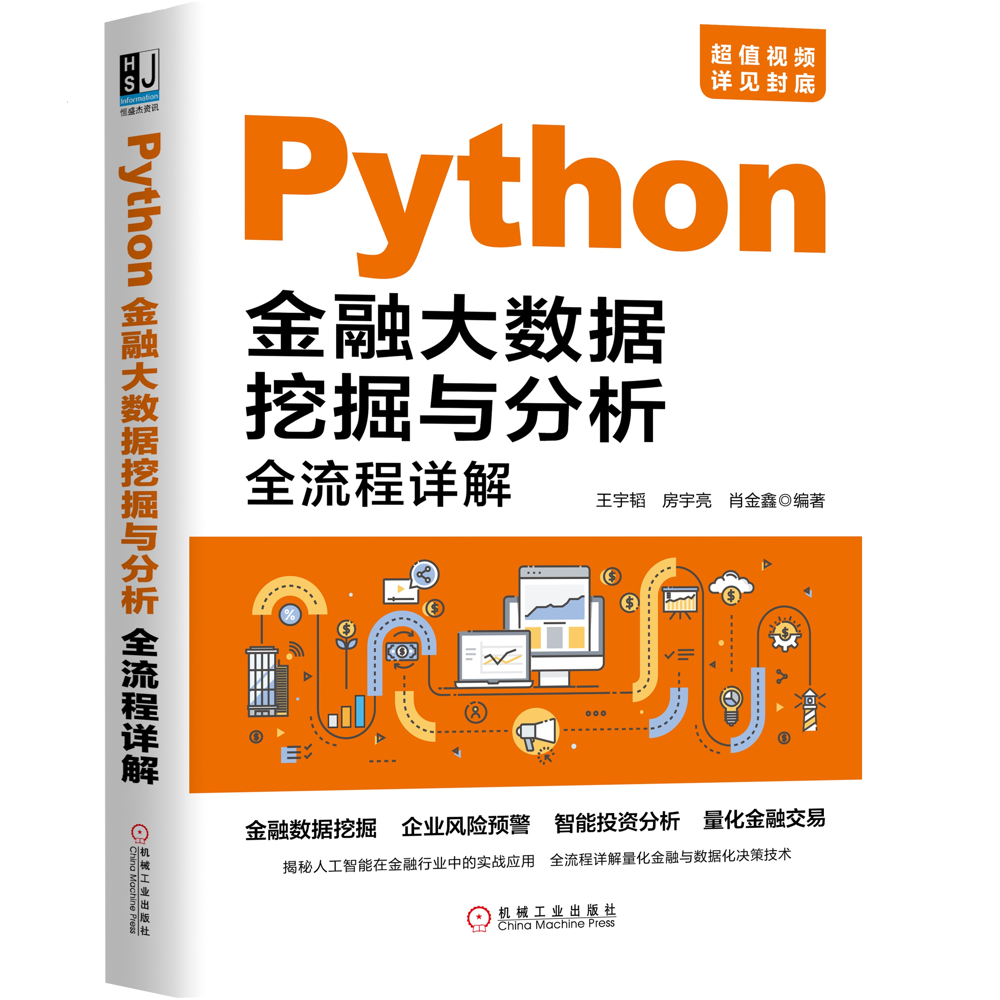
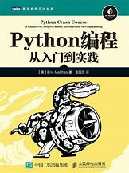

> [!NOTE]
> B 站上面的各家学习视频侧重点各有不同，可以适当参考，但没必要一节一节刷过来，学编程最快的方式还是 learn by doing 💪

## 入门准备

包括环境配置、IDE 的安装、基础语法等内容

> 可参考《Python 金融大数据挖掘与分析全流程详解》 by 王宇韬 房宇亮 肖金鑫

(注：这不是推销，自认为这是市面上对于商科初学者最好的入门读物)

点击图片阅读 ⬇️

## 数据分析基础

> 可参考《利用 Python 进行数据分析》 by Wes Mckinney

这本书是讲解数据分析的经典之作，只需通读其中几章就足以应对绝大多数的数据处理需求

### pandas入门

➡️ [点此阅读](pandas.md)

### numpy

➡️ [点此阅读](numpy.md)

### pandas 之数据处理

➡️ [点此阅读](pandasData.md)

## Matplolib 绘图

➡️ 这里同样可参考《利用 Python 进行数据分析》，[点此阅读](matplotlib.md)

[这里附赠一张 cheatsheet](matplotlib_cheatsheet.md)，画图时可以双面打印一张放在手边随时查阅

## 类与继承

> 可参考《Python 编程：从入门到实践》 by Eric Matthes

点击图片阅读 ⬇️

