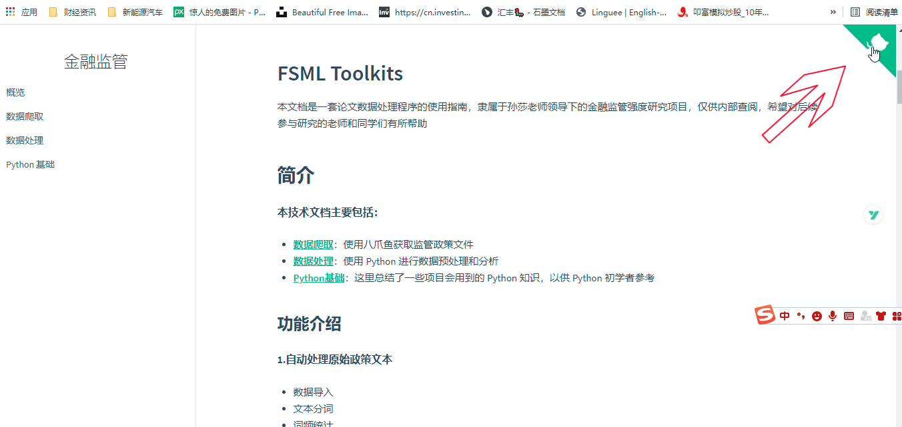
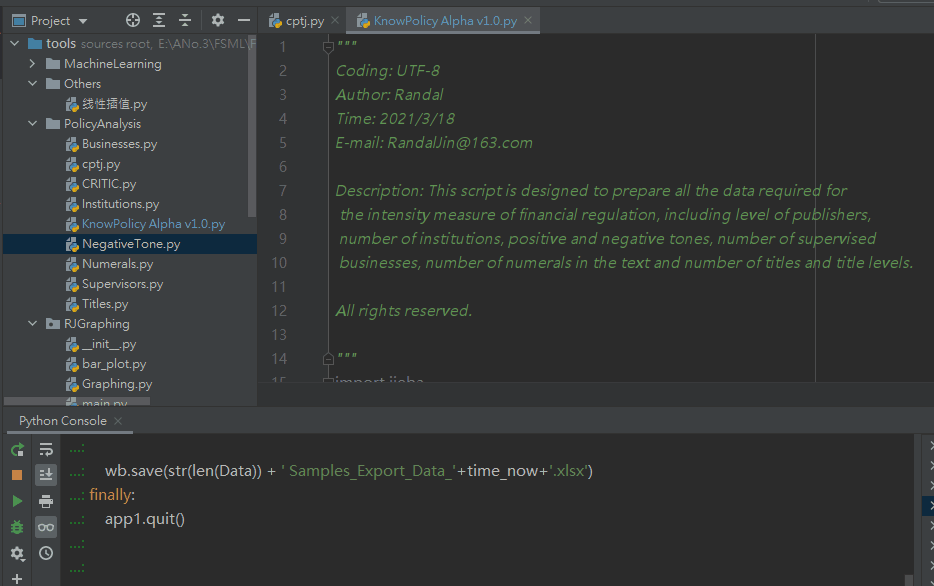
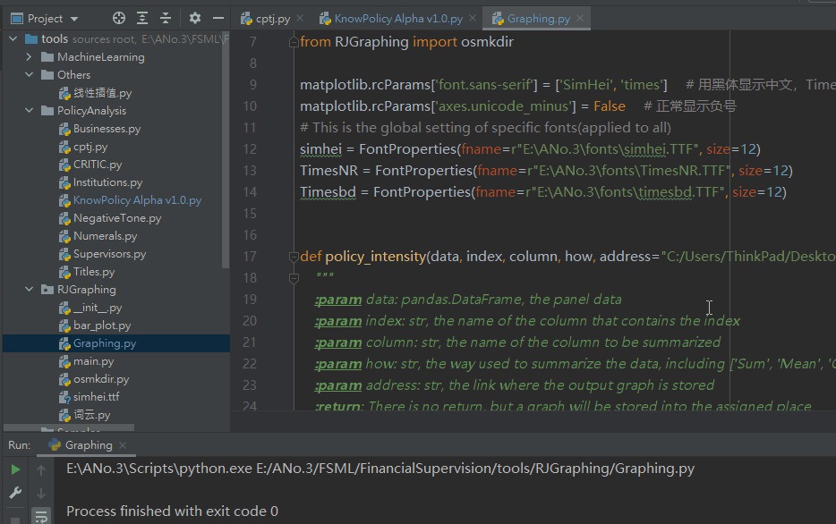
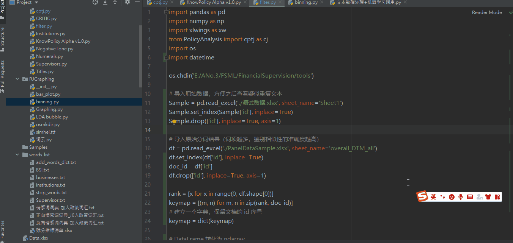

### 环境配置
请确保电脑上已安装 python 3，并完成相关配置，如果是从零开始配置，[请看这里](Python?id=入门准备)
- 推荐环境: Anaconda
- 推荐 IDE：Pycharm/VS Code
- 推荐 Python 版本：3.7 及以上
- 所需 Package:
    - pandas
    - numpy
    - matplotlib
    - xlwings
    - sklearn
    - mglearn
    - jieba
    - pyLDAvis
    - alive_progress

##### 下载并使用程序

点击右上角绿标（可能需要科学上网）> Code > Download Zip > 解压缩到本地 > 在 Pycharm 中打开 tools 文件夹



### 基本使用

本项目的路径都已经调试完毕，理论上只要下载到本地，程序都可以直接正常运行，无需改动

> [!NOTE]
> 但是如果运行程序时显示 ImportError ，可以手动添加代码，将要引用的文件所在路径临时添加进去

```python
sys.path.extend(['盘符:\\FSML项目所在地\\tools', '盘符:/FSML项目所在地/tools'])
```

因为 Python 工作时有[自己的路径搜索方式](https://blog.csdn.net/fitzzhang/article/details/78988155)，这里也可以参考本文档[关于 Python 路径的介绍](TextVect?id=_1-获取关键词清单)


#### 1.指标计算工具
- 整理关键词清单
- 打开 PolicyAnalysis > KnowPolicy Alpha v1.0.py
- 修改样本文件所在路径(os.chdir)，并选择工作簿(app1.books)和工作表(wb.sheets)

```python
"""
——————————————
First Ⅰ - Get Primary Data
——————————————
"""

# 设置项目路径
os.chdir('E:/ANo.3/FSML/FinancialSupervision/tools')

# 导入原始数据
app1 = xw.App(visible=False, add_book=False)
try:
    wb = app1.books.open("调试数据.xlsx") # 工作簿名称
    sht = wb.sheets['Sheet1']  # 工作表名称
```

- 修改面板数据保存路径

```python
"""
————————————————————————
Fourth Ⅳ - Data Export
————————————————————————
"""
# 设置数据保存路径
os.chdir('C:/Users/ThinkPad/Desktop/')
time_now = datetime.datetime.today()

```

- 整体运行程序 (Pycharm shortcut: ctrl + shift + F10)



#### 2. 批量绘图工具

> [!NOTE]
> 当前的批量绘图工具只适用于[指标体系](Indicators)下的**完整的面板数据**，即首先通过指标计算工具生成三级指标，然后通过[赋权](CRITIC)得到二级和一级指标，如果用于别处还请仔细设置图形的绘制方式

**基本使用**

- 打开 RJGraphing > Graphing.py
- 设置面板数据读取路径


```python
"""
------------------------
Execution: Graphing
------------------------
"""
def main():
    df = pd.read_excel('C:/Users/ThinkPad/Desktop/20210722_682样本政策强度.xlsx', 
    sheet_name='682样本')
```

- 设置图形绘制方式
    - 分类字段: index ('Year', 'Quarter')
    - 汇总变量：column (在面板中选定的数值变量)
    - 汇总方式: how ('Sum', 'Mean', 'Count')

```python
    # 监管强度(按年求和)
    policy_intensity(df.copy(), index='Year', column='监管强度指数', how='Sum')
```

- 设置图像保存路径(address)，注意GraphFolder是文件夹名称，如果文件夹不存在会自动新建一个文件夹

```python
def policy_intensity(data, index, column, how, address="C:/Users/ThinkPad/Desktop/GraphFolder"):
    """
    :param data: pandas.DataFrame, the panel data
    :param index: str, the name of the column that contains the index
    :param column: str, the name of the column to be summarized
```
- 整体运行程序 (Pycharm shortcut: ctrl + shift + F10)




#### 3.文本查重工具

> [!NOTE]
> 以下程序是通过计算词频向量余弦值来反映样本相似度，因此进行查重之前，需要完成一次分词 + 词频统计，得到[ DTM 词频矩阵](TextVect)。方法：1、运行指标计算工具后会自动导出几个 DTM，使用 overall_DTM_all 效果最佳  2、可以手动调用[ jieba_Vectorizer ](cptj?id=文本向量化-python-类：jieba_vectorizer)如下：

```python
# 获取一个 overall 分词结果，用于样本查重
overall = cj.jieba_vectorizer(df, userdict='./words_list/BSI.txt',
                                  stopwords='./words_list/stop_words.txt')
overall_DTM_all = overall.DTM
```


**查重程序使用方式：**

- 打开 PolicyAnalysis > filter.py
- 设置工作路径 > 设置原始数据读取路径 

```python
os.chdir('E:/ANo.3/FSML/FinancialSupervision/tools')

# 导入原始数据，方便之后查看疑似重复文本
Sample = pd.read_excel('./调试数据.xlsx', sheet_name='Sheet1')
```

- 设置词频矩阵 DTM 数据读取路径

```python
# 导入原始分词结果（词项越多，鉴别相似性的准确度越高）
df = pd.read_excel('./PanelDataSample.xlsx', sheet_name='overall_DTM_all')
```

- 设置相似度的阈值（0-1 之间）（相似度大于多少时认定为疑似重复的样本）

```python
# 调用 cptj 中计算余弦值的函数，默认余弦值(相似度)大于 0.9 时记录在案
result = cj.cos_rank(matrix, keymap, threshold=0.9)
```

- 整体运行程序




#### 4. 机器学习工具

本项目的机器学习部分还在持续探索当中，目前机器学习程序的自变量只考虑了 DTM 词频矩阵，因变量只包括监管强度，且监管强度还需要人工对样本进行贴标，因此有较大的局限性，仅供参考


