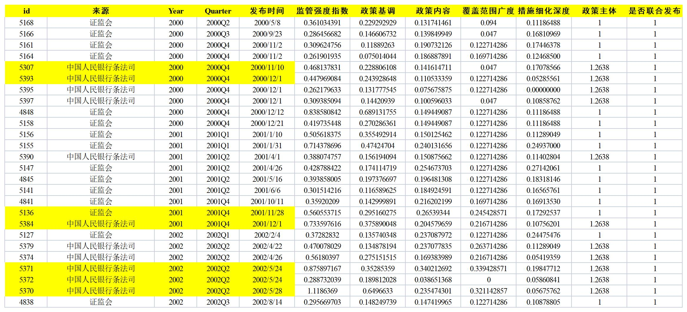
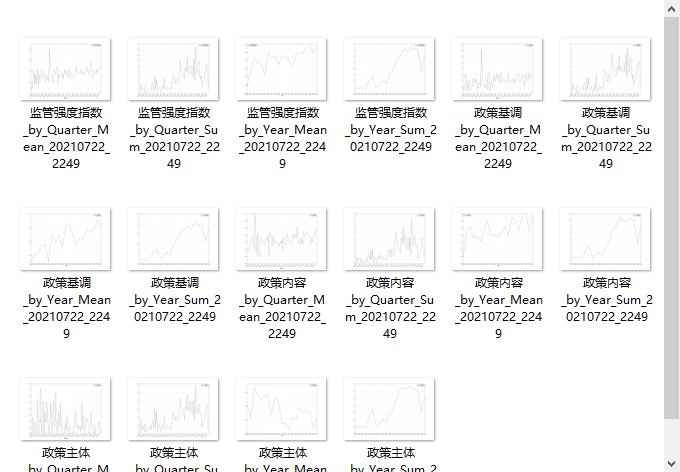

# FSML Toolkits

本文档是一套论文数据处理程序的使用指南，隶属于孙莎老师领导下的金融监管强度研究项目，仅供内部查阅，希望对后续参与研究的老师和同学们有所帮助

## 简介

##### 本技术文档主要包括：
- [数据爬取](数据爬取.html)：使用八爪鱼获取监管政策文件
- [数据处理](数据处理.md)：使用 Python 进行数据预处理和分析
- [Python基础](Python.md)：这里总结了一些项目会用到的 Python 知识，以供 Python 初学者参考

### 功能介绍
##### 1.自动处理原始政策文本
- 数据导入
- 文本分词
- 词频统计
- 指标计算

##### 初始指标体系：


##### 原始样本示例：


##### 输出效果如下：


> 此外，由于研究过程中不合格的样本、重复的样本需要剔除，遗漏的样本需要补充进来，又如果筛选标准变更，还要推倒重来。所以，对于可能频繁调整的样本，很自然地就产生了批量绘图的需求：

##### 2.批量呈现数据结果
- 按年或者按季度对某一项指标进行加总、平均、计数处理
- 批量绘制并保存图像

##### 输出效果如下：


### 项目结构
```text
tools
├─ PolicyAnalysis —— 指标计算工具
│    ├─ Businesses.py
│    ├─ CRITIC.py
│    ├─ Institutions.py
│    ├─ KnowPolicy Alpha v1.0.py
│    ├─ NegativeTone.py
│    ├─ Numerals.py
│    ├─ Supervisors.py
│    ├─ Titles.py
│    └─ cptj.py
├─ RJGraphing —— 绘图工具
│    ├─ Filter.py
│    ├─ Graphing.py
│    ├─ bar_plot.py
│    ├─ main.py
│    ├─ osmkdir.py
│    ├─ simhei.ttf
│    └─ 词云.py
├─ Samples —— 数据样例
├─ words_list —— 关键词清单
│      ├─ BSI.txt
│      ├─ Supervisor.txt
│      ├─ add_words_dict.txt
│      ├─ businesses.txt
│      ├─ institutions.txt
│      ├─ stop_words.txt
│      ├─ 正向情感词词典_加入政策词汇.txt
│      └─ 负向情感词词典_加入政策词汇.txt
|
├─ MachineLearning —— 机器学习模型
│    └─ 文本数据处理+机器学习调用.py
└─ Others
    └─ 线性插值.py
```


## 快速开始

### 环境配置
请确保电脑上已安装 python 3，并完成相关配置
- 推荐环境: Anaconda
- 推荐 IDE：Pycharm/VS Code
- 推荐 Python 版本：3.7 及以上
- 所需 Package:
    - pandas
    - numpy
    - xlwings
    - sklearn
    - mglearn
    - jieba
    - alive_progress

##### 下载并使用程序


### 基本使用
#### 1.指标计算工具
- 整理关键词清单
- 打开 PolicyAnalysis > KnowPolicy Alpha v1.0.py
- 修改样本文件所在路径(os.chdir)，并选择工作簿(app1.books)和工作表(wb.sheets)

```python
"""
——————————————
First Ⅰ - Get Primary Data
——————————————
"""

# 设置项目路径
os.chdir('E:/ANo.3/FSML/FinancialSupervision/tools')

# 导入原始数据
app1 = xw.App(visible=False, add_book=False)
try:
    wb = app1.books.open("调试数据.xlsx") # 工作簿名称
    sht = wb.sheets['Sheet1']  # 工作表名称
```

- 修改面板数据保存路径

```python
"""
————————————————————————
Fourth Ⅳ - Data Export
————————————————————————
"""
# 设置数据保存路径
os.chdir('C:/Users/ThinkPad/Desktop/')
time_now = datetime.datetime.today()

```

- 整体运行程序 (Pycharm shortcut: ctrl + shift + F10)


#### 2.批量绘图工具
- 打开 RJGraphing > Graphing.py
- 设置面板数据读取路径


```python
"""
------------------------
Execution: Graphing
------------------------
"""
def main():
    df = pd.read_excel('C:/Users/ThinkPad/Desktop/20210722_682样本政策强度.xlsx', 
    sheet_name='682样本')
```

- 设置图形绘制方式
    - 分类字段: index ('Year', 'Quarter')
    - 汇总变量：column (在面板中选定的数值变量)
    - 汇总方式: how ('Sum', 'Mean', 'Count')

```python
    # 监管强度(按年求和)
    policy_intensity(df.copy(), index='Year', column='监管强度指数', how='Sum')
```

- 设置图像保存路径(address)，注意GraphFolder是文件夹名称，如果文件夹不存在会自动新建一个文件夹

```python
def policy_intensity(data, index, column, how, address="C:/Users/ThinkPad/Desktop/GraphFolder"):
    """
    :param data: pandas.DataFrame, the panel data
    :param index: str, the name of the column that contains the index
    :param column: str, the name of the column to be summarized
```
- 整体运行程序 (Pycharm shortcut: ctrl + shift + F10)


