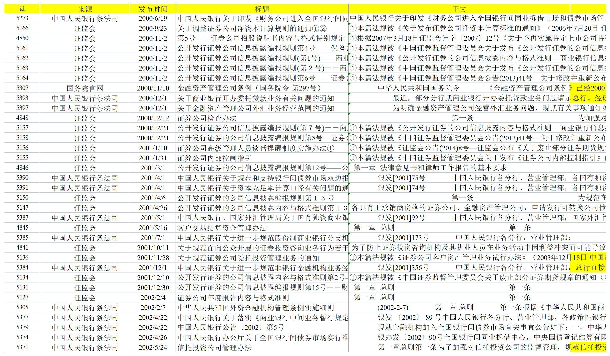

# FSML Toolkits

本文档是一套论文数据处理程序的使用指南，隶属于孙莎老师领导下的金融监管强度研究项目，仅供内部查阅，希望对后续参与研究的老师和同学们有所帮助


##### 本技术文档主要包括：
- 💡 [快速开始](QuickStart.md)：如何获取程序并快速实现几项实用功能
- 💐 [数据爬取](GetData.html)：如何使用八爪鱼获取项目所需监管政策文件
- ❤️ [数据处理](ImportData.md)：如何使用 Python 实现项目数据的精细处理
- 🥳 [绘图](SampleBin.md): 如何使用 Python 绘制本项目所需的图像
- 🔥 [支持包 cptj](cptj.md): 如何使用本项目的专属支持包 cptj（词频统计）
- 🌱 [Python基础](Python.md)：这里总结了一些项目会用到的 Python 知识，以供 Python 初学者参考

### 功能介绍
##### 1. 自动处理原始政策文本
- 数据导入
- 文本分词
- 词频统计
- 指标计算

##### 原始样本示例：

每一条数据都对应一份完整的政策文件，变量包括文件的id，来源，发布时间，标题和正文



##### 输出效果如下：

每一条数据都包含由一份政策文件计算出的三级指标：颁布主体行政级别，负向语调等（参考指标体系）


此外，由于研究过程中不合格的样本、重复的样本需要剔除，遗漏的样本需要补充进来，又如果筛选标准变更，还要推倒重来。所以，对于可能频繁调整的样本，很自然地就产生了批量绘图的需求：

##### 2. 批量呈现数据结果
- 按年或者按季度对某一项指标进行加总、平均、计数处理
- 批量绘制并保存图像

##### 输出效果如下：


##### 3. 样本查重
- 基于样本的词频统计向量，计算向量间的余弦值，从而反映样本的相似程度
- 被认为相似的样本可以自动标注以供人工检查

##### 输出效果如下：


##### 4. 机器学习检验
- 自变量：样本的词频统计矩阵；因变量：人工评价样本强度
- 可以快速查看一些常用的机器学习模型在金融监管强度上的预测效果

##### 输出效果如下：


### 项目结构
```text
tools
├─ PolicyAnalysis —— 指标计算工具
│    ├─ Businesses.py
│    ├─ CRITIC.py
│    ├─ Institutions.py
│    ├─ KnowPolicy Alpha v1.0.py
│    ├─ NegativeTone.py
│    ├─ Numerals.py
│    ├─ Supervisors.py
│    ├─ Titles.py
│    └─ cptj.py
├─ RJGraphing —— 绘图工具
│    ├─ Filter.py
│    ├─ Graphing.py
│    ├─ bar_plot.py
│    ├─ main.py
│    ├─ osmkdir.py
│    ├─ simhei.ttf
│    └─ 词云.py
├─ Samples —— 数据样例
├─ words_list —— 关键词清单
│      ├─ BSI.txt
│      ├─ Supervisor.txt
│      ├─ add_words_dict.txt
│      ├─ businesses.txt
│      ├─ institutions.txt
│      ├─ stop_words.txt
│      ├─ 正向情感词词典_加入政策词汇.txt
│      └─ 负向情感词词典_加入政策词汇.txt
|
├─ MachineLearning —— 机器学习模型
│    └─ 文本数据处理+机器学习调用.py
└─ Others
    └─ 线性插值.py
```


