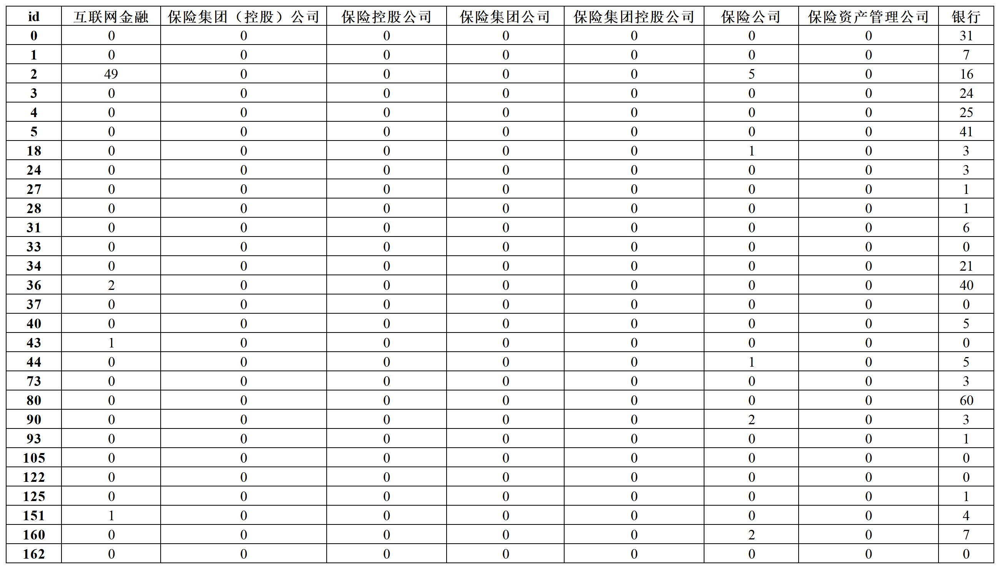
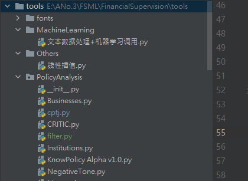

# 文本向量化<!-- {docsify-ignore} -->

在处理数据时可以使用本项目的支持包 cptj，cptj 集成了很多有用的函数，同时文本向量化的下述四个步骤也都封装在了这个库中，可以一键调用

```python
from PolicyAnalysis import cptj as cj
dtm = cj.jieba_vectorizer(data, userdict, stopwords).DTM
```
输出的结果是 DTM (DTM: Document Term Matrix，词矩阵) ，每行代表一个文件，每列代表一个词项，单元格数值表示该文件中对应关键词出现的频次



如果想获取 sklearn.CountVectorizer 产生的原始矩阵，可以令 matrix = jieba_vectorizer.DTM0

原始矩阵经过两步转化可以得到上述 dtm 的结果

```python
vect = cj.jieba_vectorizer(data, userdict, stopwords)
matrix = vect.DTM0
matrix = matrix.toarray()
features = vect.get_feature_names()
dtm = pd.DataFrame(matrix, index=tf['id'], columns=features)
```

以下为文本向量化的详细步骤，感兴趣的读者可以自行阅读或按自身需求修改

#### 1. 获取关键词清单

这是本文档第一处涉及到系统文件检索的地方，因此有必要简单说一下 [Python 路径的工作原理](https://blog.csdn.net/fitzzhang/article/details/78988155)，否则清单在哪里都不知道

一般而言，Python 检索文件是依据一个叫做 sys.path 的路径目录，而这个目录是由几个部分拼接而来：根目录、标准库目录、PYTHONPATH、site-package 目录、.pth文件列出的目录等。这里我们重点要关心的是根目录，如图，在 Pycharm 打开一个文件夹之后，最左上角的目录就是根目录，Python 会自动将这个目录设置为当前工作目录



因此接下来你可以用这个目录作为起点来编写相对路径：

- '/'表示根目录
- './'表示当前目录
- '../'表示上一级目录

比如我想获取 words_list 文件夹内的 institutions.txt 清单，就可以用这个路径：'./words_list/institutions.txt'

当然你永远都可以使用绝对路径 'E:/ANo.3/FSML/FinancialSupervision/tools/words_list/institutions.txt'，只要在自己的电脑当中运行，无论在什么位置存放项目文件，绝对路径都是有效的

但是如果我就是想用相对路径，可是想打开的文件都放在项目之外，比方说，把 words_list 文件夹移动到了桌面上，那么该怎么操作呢？

这里就可以使用系统模块 os 当中的改变工作路径函数 os.chdir，如果读者接触过 Stata，或者经常使用命令行 cmd，就可以明白 os.chdir 和 cd 的作用是相似的

> [!NOTE]
> os.chdir 规定了程序的工作目录在什么地方，文件的查、读、写、存都是在这个路径上进行，而 ./ 就指代这个工作目录，加上后面的部分就组成了完整的路径，这是相对路径的写法，较为简洁。如果提示路径不存在，多半是 ./ 定位错误，再调整一下 os.chdir 试试

```python
# os.getcwd() 可以查看当前的工作目录
# 将工作路径设置在 tools 文件夹
os.chdir('E:/ANo.3/FSML/FinancialSupervision/tools')
# 使用支持包 cptj 的 txt 转列表函数获取用户自定义词典
cj.txt_to_list('./words_list/add_words_dict.txt', sep='\n')
```

> [!TIP]
> 如果程序不支持相对路径，或者出于其他原因想要把相对路径修改为绝对路径，如'E:/ANo.3/FSML/FinancialSupervision/tools/words_list/add_words_dict.txt'，可以操作如下:

```python
abs_path = os.path.abspath('./words_list/add_words_dict.txt')
```

完成转换后再去读取 abs_path 就可以了,我们已经成功读取到了关键词清单

不过，如果读者的项目结构或存放位置做了大幅度调整，原先的相对路径有可能失灵，此时绝对路径可能是一个更好的选择


#### 2. 文本清洗

本项目中的文本清洗指的是把含有英文字母、阿拉伯数字、汉字、标点符号和其他特殊字符的文本转化为仅含汉字的文本，这一需求可以用[正则表达式](https://www.runoob.com/regexp/regexp-syntax.html)轻松实现

```python
words = []  # 新建一个列表用来存放清洗后的正文
for i, row in tf.iterrows():
    # tf 是上文获取的样本(pandas.DataFrame)
    # 这个循环可以逐行遍历 DataFrame
    try:
        result = row['正文']  # 逐行获取正文，毕竟清洗的就是正文
        rule = re.compile(u'[^\u4e00-\u9fa5]')  # 编写一个正则表达式，方括号中'^'表示'非'，'\u4e00-\u9fa5'表示所有汉字，合起来就表示汉字之外所有的其他字符
        result = rule.sub('', result)  # 使用正则表达式匹配文本中的内容，并将被匹配到的内容替换为空字符串 ''
        words.append(result)  # 清洗后的正文装入列表中
    except TypeError:  
        # 有的样本是空值，会因为无法清洗导致报错，所以要留一手
        print(i) # 报错之后就输出样本所在行，快速锁定问题样本
    continue

ff = pd.DataFrame(words) # 列表转化为 DataFrame
```

#### 3. jieba 分词

[jieba](https://github.com/fxsjy/jieba) 是目前开源社区内最好的中文分词程序包,不仅可以进行简单分词、并行分词、命令行分词，还支持关键词提取、词性标注、词位置查询等

本项目目前只用到了 jieba 的基础功能，即给定用户自定义词典和停用词词典之后，将完整文本切分为一个个词语

- **用户自定义词典：**设定一批词语，让程序优先按照这个方式进行切分，如词典中如果有 "互联网金融"，那么切分时就会优先保留 "互联网金融" ，而非切为 "互联网" 和 "金融"
- **停用词词典：**主要包括了意义不大，或者和项目无关的词汇，比如语气词、拟声词、连词等等，这些词语在切词过程中会被自动过滤掉

```python
h = int(len(words) / 20)  # 一个简易进度条的准备：获取样本长度并等分为20份 （每份为 5% ）

# 载入用户词典
jieba.load_userdict('./words_lits/add_words_dict.txt')  

words = []  # 准备一个空列表
t = 0  # 准备计数变量 t
for i, row in ff.iterrows():
    item = row[0]
    result = jieba.cut(item)  # jieba 切词得到一个列表
    
    # 以下步骤包含两层意思：
    # 1、使用空格" "将列表所有元素粘连起来，因为向量化要用到的 sklearn.CountVectorizer() 要求词与词之间以空格作为分隔,如 "互联网金融服务" > "互联网 金融 服务"
    # 2、在粘连切词结果的同时过滤停用词

    word = ''
    
    # 循环遍历切词得到的词语列表
    for element in result:
        # 如果该词不在停用词清单里
        if element not in stopwords:
            # 且该词不为缩进符
            if element != '\t':
                # 则将其粘在 word 之后
                word += element
                # 每粘连一个词，再补充一个空格符
                word += " "

    # 换言之，凡是在停用词清单里的词语，在这一过程中都被舍弃了

    words.append(word)  # 把切词后的结果装入列表

    t += 1  # 每切完一个文件，计数变量加一
    if t % h == 0:  # 打印进度条：t 每超过一份的量就打印一个方块，\r 表示每次都是从头打印，end = '' 表示不换行
        print("\r文本处理进度：{0}{1}%  ".format("■" * int(t / h), int(5 * t / h)), end='')
```

本项目后期采用了更方便的进度条，来自 [alive_progress](https://github.com/rsalmei/alive-progress) 程序包

#### 4. 分词向量化

```python
# CountVectorizer() 可以自动完成词频统计，通过 fit_transform 生成文本向量和词袋库
vect = CountVectorizer()
X = vect.fit_transform(words)  # 返回结果是一个压缩后的矩阵
X = X.toarray()  # 可以将矩阵变回我们可以操作的格式（numpy.ndarray）

# 二维 ndarray 看起来和 DataFrame 相似，但性质完全不同，ndarray 没有 index 和 column
features = vect.get_feature_names()  # 获取列标题中编号所对应的词语
XX = pd.DataFrame(X, index=tf['id'], columns=features)  # 将 ndarray 转换为 pandas.DataFrame ，更换 index 和 columns
```

这里使用了 sklearn 程序包里的 CountVectorizer 函数自动完成了分词结果的向量化，也是目前的主要操作方法，优点是简单易行，但是缺点是必须先分词再完成词频统计和向量转化，分词的方式直接和词频统计的结果直接挂钩，容易产生疏漏

因此我们基于 re 从头完成了一组词频统计的函数，放在 [cptj](cptj?id=re-词频统计函数关键词版) 支持包当中


