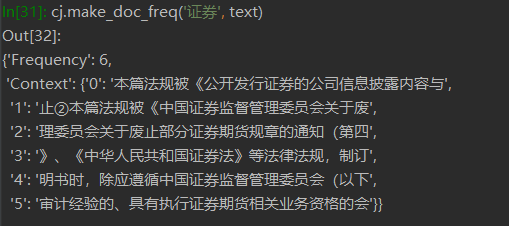

### 文本向量化 Python 类：jieba_vectorizer

jieba_vectorizer(df, userdict, stopwords, orient=False)

- df: 输入数据
- userdict: 用户自定义词典
- stopwprds: 停用词词典
- orient: 默认为 False, DTM 保留全部关键词，如果为 True, 则 DTM 内只保留用户自定义词典中的词语

这个函数是对 jieba 分词流程的简单封装（封装是为了方便调用），只需要输入数据、用户自定义词典和停用词词典，就可以自动完成文本向量化的全过程

在 [数据处理 > 文本向量化](TextVect) 有详细介绍

需要注意的是，本项目每个指标的分词流程彼此独立，各自调用了 jieba_vectorizer，也就是说，本项目的指标都各自独立地做了一次分词，而非统一分词后再计算指标，这样做主要出于三个原因：

- **指标的异质性：**有的指标适宜分词处理(如监管机构、被监管业务)，有的指标不适宜分词处理（如标题、数字）
- **计算过程的独立性：**由于指标较多，而且后续有可能拓展其他指标，因此有必要将各个指标的计算过程彼此分隔，以便于调试和改写
- **用户词典和分词目标相匹配：**用户词典也不能解决所有的问题，过于复杂的用户词典容易引起词与词之间的冲突，比如 "信托" 和 "信托公司"，"证券" 和 "证券公司"，两字强调业务属性，四字强调机构属性，如果他们都在用户词典当中，那么实际的切分结果是相当随机。但实际上，在计算业务种类数时，我们需要前者，在计算机构种类数时，我们需要后者，所以建议分头建立词典并各自分词

### re 词频统计函数(关键词版)

该词频统计函数是基于 re.finditer 函数编写的函数，最终返回的结果也是 DTM，但是 re 词频统计和 jieba 向量化的区别是，检索时没有分词的环节，比如，文本中有 "互联网金融", 关键词清单上有 "互联网金融", "互联网"，那么最终的结果将会是 "互联网金融" 和 "互联网" 各计一次

> [!NOTE]
> 本项目目前并未使用该函数，但在各个指标计算的脚本中都预留了后备程序，和 jieba 版本大体类似，如有需要，读者可以稍加修改直接调用

这一函数分为递进式的三个层次：
- 单个关键词 & 单个文本 ： make_doc_freq
- 单个关键词 & 多个文本 ： make_docs_freq
- 多个关键词 & 多个文本 ： words_docs_freq

#### make_doc_freq

make_doc_freq(word, doc)

用一个关键词去匹配一篇文本，匹配到的所有结果都记录在字典当中

- word: 关键词
- doc: 要检索的文本
- 输出： 字典，记录了关键词在文本中出现的频次及上下文




#### make_docs_freq

make_docs_freq(word, docs)

循环执行 make_doc_freq 并整理匹配结果

- word: 关键词
- docs: 装有要检索文本的 pandas.DataFrame (列的内容要求：(0:id,2:正文,4:频数))
- 输出：字典，其中包括“单关键词-单文本”的词频字典集合，以及汇总的 DFC


#### words_docs_freq

words_docs_freq(words, docs)

- word: 装有关键词的列表
- docs: 装有要检索文本的 pandas.DataFrame (列的内容要求：(0:id,2:正文,4:频数))
- 输出：字典，其中包括“单关键词-多文本”的词频字典集合，以及最终的 DFC(doc-frequency-context) 和 DTM(doc-term matrix)

在词频统计结束之后，只需要导出字典中的 DFC 和 DTM 就可以进行下一步操作

```python
result = words_docs_freq(words, docs)
dtm = result['DTM']
dfc = result['DFC']
```


### re 词频统计函数(正则表达式版)

同样是基于 re.findietr 编写的词频统计函数，但并不是直接检索关键词，而是根据[正则表达式](https://www.runoob.com/regexp/regexp-syntax.html)进行匹配

这一函数同样分为递进式的三个层次：
- 单个正则表达式 & 单个文本 ： make_info_freq
- 单个正则表达式 & 多个文本 ： make_infos_freq
- 多个正则表达式 & 多个文本 ： infos_docs_freq


#### make_info_freq

make_info_freq(name, pattern, doc)

- name: 要匹配的形式，如 "XX.XX", "(1)" 等
- pattern: 目标形式对应的正则表达式及其类型
- doc: 要检索的文本
- 输出：字典，记录关键词在文本当中出现的频次以及上下文，和 make_doc_freq 的区别在于该函数返回字典中的context元素为元组：（关键词，上下文）


#### make_infos_freq

make_infos_freq(name, pattern, docs)

- name: 要匹配的形式
- pattern: 目标形式对应的正则表达式及其类型
- docs: 装有要检索文本的 pandas.DataFrame (列的内容要求：(0:id,2:正文,4:频数))
- 输出：字典，其中包括“单关键词-单文本”的词频字典集合，以及汇总的 DFC


#### infos_docs_freq

infos_docs_freq(infos, docs)

- infos: 装有正则表达式及其类别的字典
- docs: 装有要检索文本的 pandas.DataFrame (列的内容要求：(0:id,2:正文,4:频数))
- 输出：字典，其中包括“单关键词-多文本”的词频字典集合，以及最终的 DFC(doc-frequency-context) 和 DTM (doc-term matrix)


### 计类函数


#### dtm_sort_filter

dtm_sort_filter(dtm, keymap)

- dtm: 前面生成的词频统计矩阵：Doc-Term-Matrix
- keymap: 字典，标明了  关键词-所属种类  两者关系
- 输出：返回一个字典，字典包含两个 pandas.DataFrame: 一个是表示各个种类是否存在的二进制表，另一个是最终的种类数


#### dfc_sort_filter

dfc_sort_filter(dfc, keymap)

- dfc: 前面生成的词频统计明细表：Doc-Frequency-Context
- keymap: 字典，标明了  关键词-所属种类  两者关系
- 输出：一个 pandas.DataFrame，表格有两列，一列是文本id，一列是文本中所包含的业务种类数

> [!NOTE]
> 本项目目前并未使用该函数，只是顺手预留以作后备


#### dfc_sort_counter

dfc_sort_counter(dfc)

- dfc: 前面生成的词频统计明细表：Doc-Frequency-Context
- 输出：返回一个 pandas.DataFrame，表格有两列，一列是文本id，一列是文本中所包含的业务种类数

**dfc_sort_counter 和前面的 dfc_sort_filter 的区别：**

- 无需 keymap: 直接对样式进行计数
- 输入数据不同：dfc_sort_counter 只用于 infos_docs_freq (正则表达式版) 导出的 dfc, 而 dfc_sort_filter (关键词版) 用于 words_docs_freq 导出的 dfc


**原先的 DFC 中已经有了 'form',为什么要大费周章地新建一列 'form' 再合并？**

因为左侧的 'form' 属于 index 的一部分，index 相当于 numpy.ndarray, 不同于 pandas.DataFrame, index 无法通过 index['form'] 直接提取出 'form' 的成分（至少我们没有搞懂如何做），只能按照数组的方式输入数字序号进行索引


### 赋分函数

#### dtm_point_giver

dtm_point_giver(dtm, keymap, scoremap)

- dtm: 前面生成的词频统计矩阵：Doc-Term-Matrix
- keymap: 字典，{TypeA: [word1, word2, word3, ……], TypeB: ……}
- scoremap: 字典，标明了  类别-分值 两者关系
- 输出：一个 pandas.DataFrame ，有两列，一列是文本id，一列是文本的分值（所有关键词的分值取最高）


#### dfc_point_giver

dfc_point_giver(dfc, keymap)

- dfc: 前面生成的词频统计明细表：Doc-Frequency-Context
- keymap: 字典，标明了  关键词-分值 两者关系
- 输出：一个 pandas.DataFrame，表格有两列，一列是文本id，一列是文本的分值（所有关键词的分值取最高）

和前面几个 dfc 的操作方法类似，这里计数变成了取最高分。目前这个函数在项目里还没有应用，只是**预留的后备程序**，在出现新需求（比如需要给标题或者数字赋分）时可以使用


#### 总结：如何选择正确的分拣函数

- **dtm_sort_filter:** jieba_vectorizer + 计类
- **dtm_point_giver:** jieba_vectorizer + 赋分
- **dtm_sort_filter/dfc_sort_filter:** re 词频统计函数（关键词版） + 计类
- **dfc_point_giver/dtm_point_giver:** re 词频统计函数（关键词版） + 赋分
- **dfc_sort_counter:** re 词频统计函数（正则表达式版） + 计类
- **dfc_point_giver:** re 词频统计函数（正则表达式版） + 赋分


### 日期格式函数

下面一系列函数都是修改日期格式的小工具

#### re_formatter

re_formatter(file_time)

将输入的时间统一由YYYY-DD-MM修改为YYYY/MM/DD

- file_time: 输入的时间, 纯字符串格式
- 输出：返回的时间，datetime格式(%YYYY/%MM/%DD)

#### year_month_finder

year_month_finder(file_time)

将输入的时间统一由YYYY/DD/MM修改为YYYY年M月

- file_time: 输入的时间, 纯字符串格式
- 输出: 返回的时间，格式为(%YYYY年%M月)


#### month_day_finder

month_day_finder(file_time)

将输入的时间统一由YYYY/DD/MM修改为M月D日

- file_time: 输入的时间, 纯字符串格式
- 输出: 返回的时间，格式为(%M%月/%D%日)


#### quarter_finder

quarter_finder(file_time)

将输入的时间统一由YYYY/DD/MM修改为YYYY年Q季度

- file_time: 输入的时间, 纯字符串格式
- 输出: 返回的时间，格式为(%YYYY年%Q季度)


#### quarter2date

quarter2date(date)

将字符串格式的时间如 '2021Q4' 转化为 datetime.date 格式

这个函数只在柱线混合图 (bar_plot.py) 当中使用，将季度变为该季度的第一天，目的是美化横坐标轴，[如图](BarPlot)

- date: 输入的时间，字符串格式，只针对 '2020Q3' 格式
- 输出：返回的时间，为 datetime.date(YYYY-MM-DD) 格式


### 其他辅助函数

#### top_n_sent

top_n_sent(n, doc, percentile=1)

**计算方式：**找到表示语义终结的标点符号：[!?。]，确定其位置，然后以此为位置索引，选取我们所要的文本范围

选取范围有两种方式：

- n ： 设定只要前 n 个句子，
- percentile： 设定只要前多少百分比个句子，比如 11 个句子取前 50%，11 × 50% = 5.5，**向下取整**，得到 5 个句子

```python
info = '[。？！]'
re_iter = list(re.finditer(info, doc))
# max_iter 是 re 匹配到的最大次数
max_iter = len(re_iter)

# 这一句表示，正文过于简短，或者没有标点，此时直接输出全文
if max_iter == 0:
    return doc

# 考虑 percentile 的情况，如果总共有11句，就舍弃掉原来的 n，直接改为总句数的 percentile 对应的句子数
# 注意是向下取整
if percentile != 1:
    n = math.ceil(percentile * max_iter)
    # 如果匹配到至少一句，循环自然结束，输出结果
    if n > 0:
        return doc[0: re_iter[n - 1].end()]
    # 如果正文过于简短，或设定的百分比过低，一句话都凑不齐，此时直接输出第一句
    elif n == 0:
        return doc[0: re_iter[0].end()]

# 如果匹配到的句子数大于 n，此时只取前 n 句
if max_iter >= n:
    return doc[0: re_iter[n - 1].end()]
# 如果匹配到的句子不足 n 句，直接输出全部内容
elif 0 < max_iter < n:
    return doc[0: re_iter[-1].end()]
```

> [!NOTE]
> - percentile 默认值为 1，此时以句子个数 n 为准切割内容，但是若 percent 小于 1，则舍弃句子个数，以 percentile 为准
> - 前 50% 的句子并非包括一半字数的内容，而是前 50% 个句子（5句 in 10句）


#### match_cut

match_cut(matchobj, cls)

（这个函数仅在 make_info_freq 当中使用）

- matchobj: 匹配好的字符串
- cls: 正则表达式类型（规定了多余字符的剔除方式）

正则表达式匹配到的结果并不能直接使用，原因是我们在首尾规定的字符也被匹配到了，比如，我们想要夹在汉字中间的阿拉伯数字，可以这样编写正则表达式：

```python
[\u4e00-\u9fa5][0-9]+[\u4e00-\u9fa5]'
```

但匹配到的结果是这样的："于30天", "第5号"，首尾多了两个我们不需要的汉字，因此还需要剔除一次多余的成分。比如这个例子，剔除的方式就是 "掐头去尾"，前后各去一

全部正则表达式类型及剔除方式：

- 0：原样奉还
- 1：掐一去一
- 2：掐一去二
- 3：掐二去一
- 4：掐一去零
- 5：掐零去一


#### dataframe_filter

一个简单的取样函数，适用于 DataFrame 很大，清单很长的情况

dataframe_filter(df, keywords, axis)
- df: 要过滤的样本框
- keywords: list, 关键词清单: 要保留的 index 或 columns
- axis: integer, 过滤的方向，axis=0 为竖直方向，axis=1 为水平方向
- 输出: 过滤好的样本框


#### list_to_txt

list_to_txt(name, content, sep = '\n')

name: 要写入的 txt 文件名，文件不存在的话会自动创建，如 "Data.txt"
content: 要写入记事本的列表
sep: 分隔符，指的是列表元素写入记事本时以什么作为分隔，默认为换行符 '\n'

将一个列表写入记事本，*并自动保存在工作路径之中*，可以作为一种保存数据的手段

注意列表里必须都是字符串 str，不能有其他成分

#### txt_to_list

txt_to_list(path, sep = '\n')

path: 要读取的 txt 文件所在路径，如 "./Data.txt"
sep: 分隔符，指的是读取记事本的内容时以什么作为分隔，默认为换行符 '\n'，即一行为一个元素

自动读取当前工作路径上的一个记事本，并将其内容转换为 Python 列表

注意读取到的列表中都是字符串格式 str（包括数字），如果需要别的格式记得手动调整

#### doc_filter

dataframe_filter 的早期版本，只能过滤 index，主要用来选择需要的 Doc

doc_filter(df, target)
- df: 要进行样本筛选的数据框
- target: 符合要求的 index 列表
- 输出: 只保留符合要求 index 对应样本的数据框


#### vec_cos

vec_cos(arr1, arr2)

一个简单的计算两个向量 cos 值的函数，cos 值可以衡量两个向量之间的相近程度，cos 值越大，向量越相近，计算这个值可以用于样本去重

$$\cos\theta = {{\vec{a} \cdot \vec{b}} \over {\mid\vec{a}\mid\mid\vec{b}\mid}}$$

- arr1:  the first np.array
- arr2:  the second np.array
- cos(θ) (θ: the angle between two vectors)


#### cos_rank

cos_rank(matrix, keymap=None)

- matrix: (np.array) 包含所有词频向量的矩阵
- keymap: (dictionary) 如果要保留原有向量 id，可以输入一个字典 {$0:id_1$, $1:id_2$, $3:id_3$, ·····}
- 输出： (pd.DataFrame) 相似度排行


