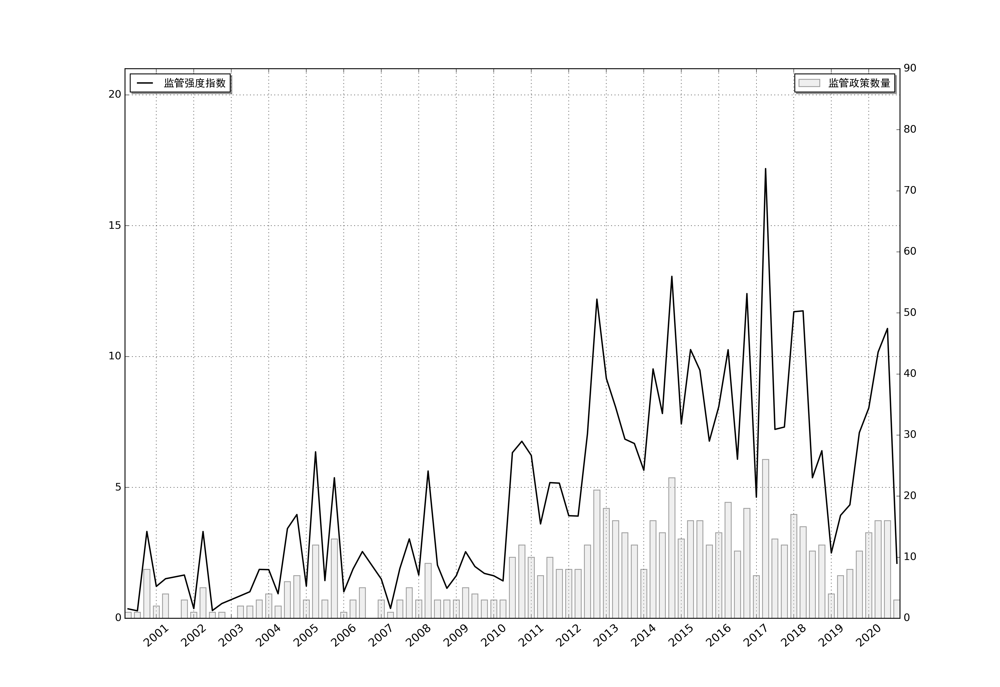

## 样本分筛图

见 tools > RJGraphing > binning.py

样本分筛图本质上是一个频率分布直方图，纵轴是关键词的频次（关键词来源于关键词清单），横轴是我们设置的档位，通过这个图我们可以快速地看到和研究主题相关的文本大概有多少，从而简单评估一下样本的质量

虽然 Hist 图用 Stata 可以轻松画出来，但是本项目的亮点在于可以在画图的同时，把对应的文本也分拣到不同的 Sheet 当中，方便后续进行处理

```python
shell = pd.DataFrame()
for item in lst:
    if item in n:
        shell = pd.concat([shell, XX[item]], axis=1)
shell['Sum'] = shell.sum(axis=1)

x = shell[['Sum']]
x.insert(0, 'doc-id', x.index)
freq = {'>=0': 0, '>=1': 0, '>=2': 0, '>=3': 0, '>=4': 0, '>=5': 0, '>=6': 0, '>=7': 0, '>=8': 0, '>=9': 0, '>=10': 0, '>=11': 0}

app2 = xw.App(visible=False, add_book=False)
wb = app2.books.open('样本分筛.xlsx')
try:
    for i, row in x.iterrows():
        if row['Sum'] >= 0:
            freq['>=0'] += 1
        if row['Sum'] >= 1:
            freq['>=1'] += 1
        if row['Sum'] >= 2:
            freq['>=2'] += 1
        if row['Sum'] >= 3:
            freq['>=3'] += 1
        if row['Sum'] >= 4:
            freq['>=4'] += 1
        if row['Sum'] >= 5:
            freq['>=5'] += 1
        if row['Sum'] >= 6:
            freq['>=6'] += 1
        if row['Sum'] >= 7:
            freq['>=7'] += 1
        if row['Sum'] >= 8:
            freq['>=8'] += 1
        if row['Sum'] >= 9:
            freq['>=9'] += 1
        if row['Sum'] >= 10:
            freq['>=10'] += 1
        if row['Sum'] >= 11:
            freq['>=11'] += 1

    # sht = wb.sheets('>=0次')
    # sht.range('A1').value = df.loc[x[x['Sum'] >= 0].index]
    # sht = wb.sheets('>=1次')
    # sht.range('A1').value = df.loc[x[x['Sum'] >= 1].index]
    # sht = wb.sheets('>=2次')
    # sht.range('A1').value = df.loc[x[x['Sum'] >= 2].index]
    # sht = wb.sheets('>=3次')
    # sht.range('A1').value = df.loc[x[x['Sum'] >= 3].index]
    # sht = wb.sheets('>=4次')
    # sht.range('A1').value = df.loc[x[x['Sum'] >= 4].index]
    # sht = wb.sheets('>=5次')
    # sht.range('A1').value = df.loc[x[x['Sum'] >= 5].index]
    # sht = wb.sheets('>=6次')
    # sht.range('A1').value = df.loc[x[x['Sum'] >= 6].index]
    # sht = wb.sheets('>=7次')
    # sht.range('A1').value = df.loc[x[x['Sum'] >= 7].index]
    # sht = wb.sheets('>=8次')
    # sht.range('A1').value = df.loc[x[x['Sum'] >= 8].index]
    # sht = wb.sheets('>=9次')
    # sht.range('A1').value = df.loc[x[x['Sum'] >= 9].index]
    # sht = wb.sheets('>=10次')
    # sht.range('A1').value = df.loc[x[x['Sum'] >= 10].index]
    # sht = wb.sheets('>=11次')
    # sht.range('A1').value = df.loc[x[x['Sum'] > 10].index]

    wb.save()
finally:
    app2.quit()
```


## 柱线混合图

见 RJGraphing > bar_plot.py

matplotlib 相关知识可以参见[ Python 基础](Python?id=matplolib-绘图)




## LDA 主题气泡图

见 RJGraphing > LDA bubble.py

下方是一个 LDA 主题气泡图的实例，可以点击体验

➡️ [LDA 示例](LDA示例.html)


关于 LDA 的原理和应用这里就不多加赘述，如果想深入了解可以参见下方资料，看不懂的话可以在 Youtube 搜索相关视频，资源很多

➡️ [LDA 数学八卦](LDAsxbg.md)

➡️ [原版 LDA 论文](LDApdf.md)


**绘制方式：**设置当前工作路径(也是数据读取路径) > 选择用户自定义词典和停用词典的路径 > 选择主题数 n > 设置气泡图文件保存路径 > 整体运行程序 (Pycharm Shortcut: ctrl + shift + F10)

在画图过程中会出现 Deprecation Warning, 无需理会，不影响程序运行


## 词云图

见 RJGraphing > 词云.py

代码很简单，设置好分辨率、背景色，输入一条文本，再设置保存路径即可

```python
w1 = wordcloud.WordCloud(font_path='simhei.ttf', width=1200, height=800, background_color='white')
w1.generate(doc)
w1.to_file(name + ".png")
```

[更多使用方式](https://blog.csdn.net/fontthrone/article/details/72775865)
