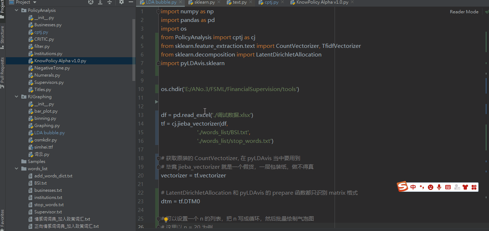

## 样本分筛图

见 tools > RJGraphing > binning.py

样本分筛图本质上是一个频率分布直方图，纵轴是关键词出现的总频次（关键词来源于关键词清单），横轴是我们设置的档位，通过这个图我们可以快速地看到和研究主题相关的文本大概有多少，从而简单评估一下样本的质量


虽然 Hist 图用 Stata 可以轻松画出来，但是本项目的亮点在于可以在画图的同时，把对应的文本也分拣到不同的 Sheet 当中，方便后续进行处理


分筛过程其实就是一手拿着 DTM，一手拿着原始数据，循环计数，按照关键词的总词频将样本筛开来

## 柱线混合图

见 RJGraphing > bar_plot.py

matplotlib 相关知识可以参见[ Python 基础](Python?id=matplolib-绘图)

绘图思路和[批量绘图工具](QuickStart?id=_2批量绘图工具)一致: 调整工作路径 > 设置图像各项属性（如有必要）> 设置保存路径 > 整体运行程序


绘图时要注意数据中的变量名和程序相匹配


## LDA 主题气泡图

见 RJGraphing > LDA bubble.py

下方是一个 LDA 主题气泡图的实例，可以点击体验

➡️ [LDA 示例](LDA示例.html)


关于 LDA 的原理和应用这里就不多加赘述，如果想深入了解可以参见下方资料，看不懂的话可以在 Youtube 搜索相关视频，资源很多

➡️ [LDA 数学八卦](LDAsxbg.md)

➡️ [原版 LDA 论文](LDApdf.md)


**绘制方式：**设置当前工作路径(也是数据读取路径) > 选择用户自定义词典和停用词典的路径 > 选择主题数 n > 设置气泡图文件保存路径 > 整体运行程序 (Pycharm Shortcut: ctrl + shift + F10)

在画图过程中会出现 Deprecation Warning, 无需理会，不影响程序运行




## 词云图

见 RJGraphing > 词云.py

代码很简单，设置好分辨率、背景色，输入一条文本，再设置保存路径即可

```python
w1 = wordcloud.WordCloud(font_path='simhei.ttf', width=1200, height=800, background_color='white')
w1.generate(doc)
w1.to_file(name + ".png")
```

[词云图更多使用](https://blog.csdn.net/fontthrone/article/details/72775865)
