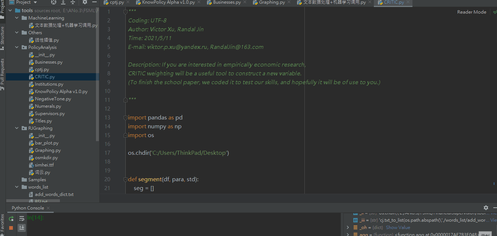

## 客观赋权<!-- {docsify-ignore} -->

本项目的数据处理程序只能计算至三级指标，但如果想进一步分析，还需要由三级指标逐级赋权，计算出二级和一级指标

本项目只完成了客观赋权法(CRITIC)的 Python 代码，如果使用 PCA, 熵权法等其他赋权方法，还请在 SPSS/Stata 等软件中自行完成

**客观赋权方法操作：**

打开 tools 自带的 CRITIC.py > 修改数据导入路径 > 调整赋权顺序 > 修改结果保存路径

