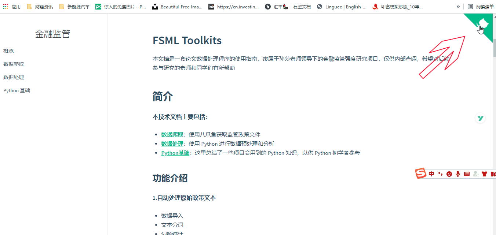
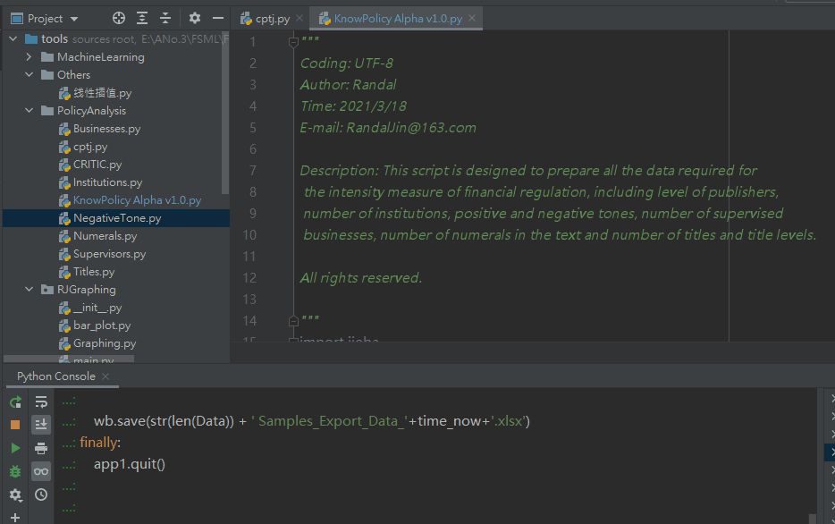
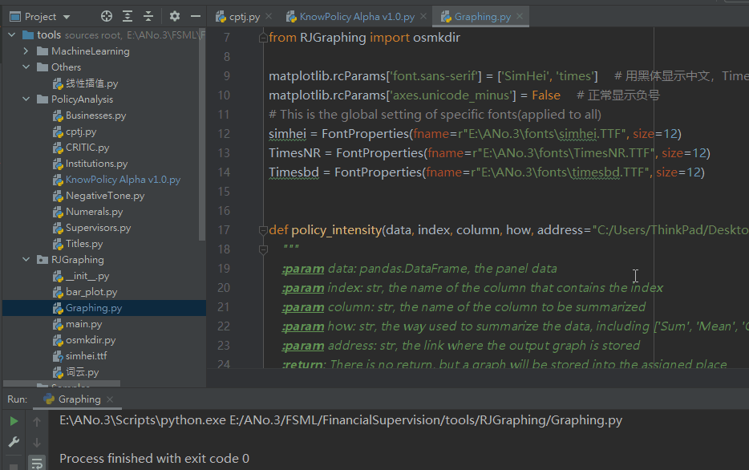

### 环境配置
请确保电脑上已安装 python 3，并完成相关配置
- 推荐环境: Anaconda
- 推荐 IDE：Pycharm/VS Code
- 推荐 Python 版本：3.7 及以上
- 所需 Package:
    - pandas
    - numpy
    - matplotlib
    - xlwings
    - sklearn
    - mglearn
    - jieba
    - pyLDAvis
    - alive_progress

##### 下载并使用程序



### 基本使用
#### 1.指标计算工具
- 整理关键词清单
- 打开 PolicyAnalysis > KnowPolicy Alpha v1.0.py
- 修改样本文件所在路径(os.chdir)，并选择工作簿(app1.books)和工作表(wb.sheets)

```python
"""
——————————————
First Ⅰ - Get Primary Data
——————————————
"""

# 设置项目路径
os.chdir('E:/ANo.3/FSML/FinancialSupervision/tools')

# 导入原始数据
app1 = xw.App(visible=False, add_book=False)
try:
    wb = app1.books.open("调试数据.xlsx") # 工作簿名称
    sht = wb.sheets['Sheet1']  # 工作表名称
```

- 修改面板数据保存路径

```python
"""
————————————————————————
Fourth Ⅳ - Data Export
————————————————————————
"""
# 设置数据保存路径
os.chdir('C:/Users/ThinkPad/Desktop/')
time_now = datetime.datetime.today()

```

- 整体运行程序 (Pycharm shortcut: ctrl + shift + F10)



#### 2.批量绘图工具
- 打开 RJGraphing > Graphing.py
- 设置面板数据读取路径


```python
"""
------------------------
Execution: Graphing
------------------------
"""
def main():
    df = pd.read_excel('C:/Users/ThinkPad/Desktop/20210722_682样本政策强度.xlsx', 
    sheet_name='682样本')
```

- 设置图形绘制方式
    - 分类字段: index ('Year', 'Quarter')
    - 汇总变量：column (在面板中选定的数值变量)
    - 汇总方式: how ('Sum', 'Mean', 'Count')

```python
    # 监管强度(按年求和)
    policy_intensity(df.copy(), index='Year', column='监管强度指数', how='Sum')
```

- 设置图像保存路径(address)，注意GraphFolder是文件夹名称，如果文件夹不存在会自动新建一个文件夹

```python
def policy_intensity(data, index, column, how, address="C:/Users/ThinkPad/Desktop/GraphFolder"):
    """
    :param data: pandas.DataFrame, the panel data
    :param index: str, the name of the column that contains the index
    :param column: str, the name of the column to be summarized
```
- 整体运行程序 (Pycharm shortcut: ctrl + shift + F10)


