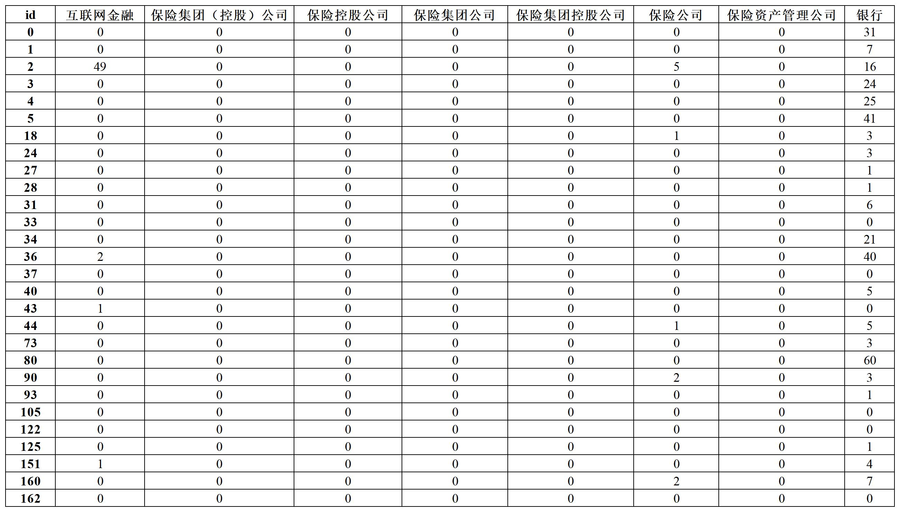
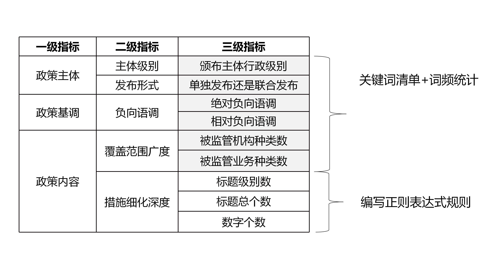

## 导入数据

项目代码统一使用 [xlwings](https://docs.xlwings.org/zh_CN/latest/quickstart.html) 导入和导出数据

##### xlwings 的优点：
- 延展性好
- 更灵活，可实现精细化操作（循环写入，调整单元格格式）

导入数据流程：创建实例 > 打开工作表 > 选择工作簿 > 读取数据 > 调整格式 > 关闭实例

```python
app1 = xw.App(visible=False, add_book=False)  
# 定义一个实例 app1
# visible=False 表示程序操作 excel 表格的过程不可见，想看表格实时变动的话就设置 visible=True
# add_book=False 表示不新建工作簿，如果不设置的话，由于 add_book 默认为 True，哪怕打开已存在的文件，xlwings 还是会新建一个工作簿

try:
    # 为什么要使用 try···finally··· 格式？
    # 因为 app 用完后应该及时关闭，忘记关闭 app 就退出 IDE 可能导致进程堵塞，会导致电脑的 excel 软件异常。一个常见的情况是程序运行报错后，由于疏忽大意就会忘记关闭 app，因此影响软件工作。
    # 而 try···finally··· 专为应付突发情况（文件不存在，名字打错了等），无论是否报错，finally 后的语句一定会执行，这样就可以保证会自动关闭 app。

    wb = app1.books.open("调试数据.xlsx")  # 打开工作簿
    sht = wb.sheets['Sheet1']  # 定位工作表

    df = sht.used_range.value  # 获取 Sheet 内全部数据
    df = pd.DataFrame(df)  # 将获取的数据转换为 pandas.DataFrame
    df.columns = list(df.loc[0])  # 获取数据首行作为变量名
    df.drop(0, axis=0, inplace=True)  # 删除首行(相当于 Stata 的 firstrow)
    df.reset_index(inplace=True, drop=True)  # 
finally:
    app1.quit()  # 关闭实例

tf = df.copy()  # copy 样本的原因是万一后续程序出错，不至于重头再来，尤其适用于逐行运行/调试的时候，建议每一步都先备份，因为有的步骤会相当耗时
```

更简单的数据导入方法是使用 pandas 自带的数据读取函数

##### pandas 函数优点：
- 简单
- 读取速度快

```python
df = pd.read_excel('C:/Users/ThinkPad/Desktop/Data.xlsx', sheet_name='Sheet1')
```

其他的操作 excel 的 package 还包括 [xlrd](https://xlrd.readthedocs.io/en/latest/)、[openpyxl](https://openpyxl.readthedocs.io/en/stable/tutorial.html) 等

## 文本向量化

在处理数据时可以使用本项目的支持包 cptj，cptj 集成了很多有用的函数，同时文本向量化的下述四个步骤也都封装在了这个库中，可以一键调用

```python
from PolicyAnalysis import cptj as cj
dtm = cj.jieba_vectorizer(data, userdict, stopwords).DTM
```
输出的结果是 DTM (DTM: Document Term Matrix，词矩阵) ，每行代表一个文件，每列代表一个词项，如下所示：



以下为文本向量化的详细步骤，感兴趣的读者可以自行阅读或按自身需求修改

#### 1. 获取关键词清单

> 说明：os.chdir 规定了程序的工作目录在什么地方，文件的查、读、写、存都是在这个路径上进行，而 ./ 就指代这个工作目录，加上后面的部分就组成了完整的路径，这是相对路径的写法，较为简洁
- '/'表示根目录
- './'表示当前目录
- '../'表示上一级目录

```python
# os.getcwd() 可以查看当前的工作目录
os.chdir('E:/ANo.3/FSML/FinancialSupervision/tools')
cj.txt_to_list('./words_list/add_words_dict.txt', sep='\n')
```

> 如果程序不支持相对路径，或者出于其他原因想要把相对路径修改为绝对路径，如'E:/ANo.3/FSML/FinancialSupervision/tools/words_list/add_words_dict.txt'，可以操作如下:

```python
abs_path = os.path.abspath('./words_list/add_words_dict.txt')
cj.txt_to_list(abs_path, sep='\n')
```

#### 2. 文本清洗

本项目中的文本清洗指的是把含有英文字母、阿拉伯数字、汉字、标点符号和其他特殊字符的文本转化为仅含汉字的文本，这一需求可以用[正则表达式](https://www.runoob.com/regexp/regexp-syntax.html)轻松实现

```python
words = []  # 新建一个列表用来存放清洗后的正文
for i, row in tf.iterrows():
    # tf 是上文获取的样本(pandas.DataFrame)
    # 这个循环可以逐行遍历 DataFrame
    try:
        result = row['正文']  # 逐行获取正文，毕竟清洗的就是正文
        rule = re.compile(u'[^\u4e00-\u9fa5]')  # 编写一个正则表达式，方括号中'^'表示'非'，'\u4e00-\u9fa5'表示所有汉字，合起来就表示汉字之外所有的其他字符
        result = rule.sub('', result)  # 使用正则表达式匹配文本中的内容，并将被匹配到的内容替换为空字符串 ''
        words.append(result)  # 清洗后的正文装入列表中
    except TypeError:  
        # 有的样本是空值，会因为无法清洗导致报错，所以要留一手
        print(i) # 报错之后就输出样本所在行，快速锁定问题样本
    continue

ff = pd.DataFrame(words) # 列表转化为 DataFrame
```

#### 3. jieba 分词

```python
h = int(len(words) / 20)  # 一个简易进度条的准备：获取样本长度并等分为20份 （每份为 5% ）

words = []  # 准备一个空列表
t = 0  # 准备计数变量 t
for i, row in ff.iterrows():
    item = row[0]
    result = jieba.cut(item)  # jieba 切词得到一个列表
    word = " ".join(result)  # 使用空格" "将列表所有元素粘连起来，因为向量化要用到的 sklearn.CountVectorizer() 要求词与词之间以空格作为分隔,如 "互联网金融服务" > "互联网 金融 服务"
    words.append(word)  # 把切词后的结果装入列表

    t += 1  # 每切完一个文件，计数变量加一
    if t % h == 0:  # 打印进度条：t 每超过一份的量就打印一个方块，\r 表示每次都是从头打印，end = '' 表示不换行
        print("\r文本处理进度：{0}{1}%  ".format("■" * int(t / h), int(5 * t / h)), end='')
```

本项目后期采用了更方便的进度条，来自 [alive_progress](https://github.com/rsalmei/alive-progress) 程序包

#### 4. 分词向量化

```python
# CountVectorizer() 可以自动完成词频统计，通过fit_transform生成文本向量和词袋库
vect = CountVectorizer()
X = vect.fit_transform(words)  # 返回结果是一个压缩后的矩阵
X = X.toarray()  # 可以将矩阵变回我们可以操作的格式（numpy.ndarray）

# 二维 ndarray 看起来和 DataFrame 相似，但性质完全不同，ndarray 没有 index 和 column
features = vect.get_feature_names()  # 获取列标题中编号所对应的词语
XX = pd.DataFrame(X, index=tf['id'], columns=features)  # 将 ndarray 转换为 pandas.DataFrame ，更换 index 和 columns
```


## 词频统计


## 指标计算

##### 初始指标体系：



## 输出数据


